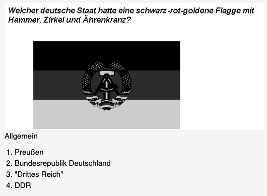

# Anki Deck für den deutschen Einbürgerungstest (alle Bundesländer)

Dieses Skript scrapt die Fragen und Antworten für den deutschen Einbürgerungstest von http://oet.bamf.de/.
Die Daten werden in einer SQLite3-Datenbank gespeichert und anschließend exportiert, um sie mit Anki zu nutzen

- [Finales Anki-Deck auf AnkiWeb](https://ankiweb.net/shared/info/1428016787) **!wird nicht automatisch aktualisiert!**
- [Finales Anki-Deck als .apkg herunterladen](https://github.com/ignamv/einbuergerungstest/releases) <= **täglich generiert**

Im generierten Deck sind alle Notizen entsprechend den Bundesländern gekennzeichnet. Dadurch kannst
du leicht nur die Notizen filtern, die für dich relevant sind.

## Note Beispiel



# Nutzung
Verwende eine der folgenden Optionen:

- Herunterladen aus den Releases
- Einmaliges Ausführen mit Docker Compose
- Manuelles Installieren der Abhängigkeiten und Ausführen der Skripte

## Herunterladen aus den Releases

Lade die neueste `*.apkg`-Datei aus den GitHub-Releases herunter. Die Fragen werden täglich automatisch
gescrapt. Wähle die aktuellste Version.

## Einmaliges Ausführen mit Docker Compose

```bash
git clone https://github.com/ignamv/einbuergerungstest.git
cd einbuergerungstest
docker compose up --abort-on-container-exit --build
```

Öffne Anki und importiere die Datei `out/anki/einbuergerung-quiz-*.apkg`.

## Manuelle Ausführung
### Scraper
Installiere die benötigten Abhängigkeiten:

```
pip install -r requirements.txt
```

Lade den [Geckodriver](https://github.com/mozilla/geckodriver/releases) herunter und führe das Skript
aus, wobei das Geckodriver-Verzeichnis im PATH enthalten sein muss, z. B.:

```
env PATH=$HOME/Downloads:$PATH python3 scrape.py
```

Wenn du unter Ubuntu einen Fehler über ein nicht zugängliches Profil erhältst,
versuche, ein temporäres Verzeichnis (TMPDIR) festzulegen:

```
mkdir tmp
env PATH=$HOME/Downloads:$PATH TMPDIR=./tmp python3 scrape.py
```

### Anki writer

Dieses Skript generiert eine `.apkg`-Datei, die Bildfragen enthält.

```
python3 output.py
```

## Danksagungen

Vielen Dank an @nikste und @prepor für ihre Beiträge!
